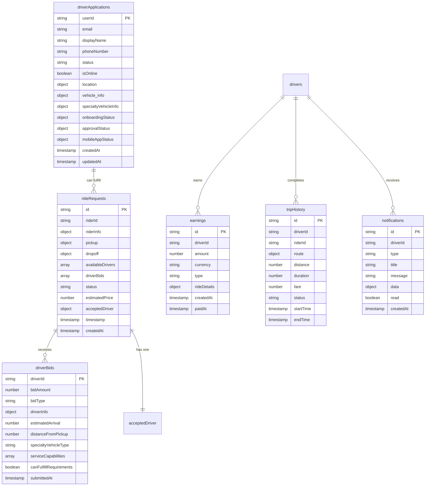

# Database Schema

## Overview

RydeIQ Driver uses Firebase Firestore as its primary database. This document outlines the collection structure, data models, and relationships between different entities.

## Collection Structure



## Core Collections

### driverApplications

Primary collection storing driver profiles and application data.

```javascript
// Document ID: userId (Firebase Auth UID)
{
  // Basic Information
  userId: "string",                    // Firebase Auth UID
  email: "string",                     // Driver email
  displayName: "string",               // Driver display name
  phoneNumber: "string",               // Contact number
  
  // Status & Availability
  status: "string",                    // "offline" | "available" | "busy" | "break"
  isOnline: "boolean",                 // Online status
  location: {                          // Current location
    latitude: "number",
    longitude: "number",
    accuracy: "number",
    timestamp: "timestamp"
  },
  
  // Vehicle Information
  vehicle_info: {
    make: "string",                    // Vehicle make
    model: "string",                   // Vehicle model
    year: "number",                    // Vehicle year
    color: "string",                   // Vehicle color
    licensePlate: "string",            // License plate
    vin: "string"                      // Vehicle identification number
  },
  
  // Specialty Vehicle Information
  specialtyVehicleInfo: {
    specialtyVehicleType: "string",    // "standard" | "wheelchair" | "medical" | "luxury"
    serviceCapabilities: ["string"],   // ["wheelchair_access", "medical_equipment", "child_seat"]
    certificationFiles: {              // Required certifications
      [certType]: "string"             // File URLs
    }
  },
  
  // Application Status
  onboardingStatus: {
    completed: "boolean",
    completedAt: "timestamp",
    completedBy: "string",
    lastUpdated: "timestamp"
  },
  
  approvalStatus: {
    status: "string",                  // "pending" | "approved" | "rejected" | "suspended"
    approvedAt: "timestamp",
    approvedBy: "string",
    notes: "string"
  },
  
  // Mobile App Integration
  mobileAppStatus: {
    accountCreated: "boolean",
    accountCreatedAt: "timestamp",
    lastMobileLogin: "timestamp"
  },
  
  // Metadata
  lastStatusUpdate: "timestamp",
  lastLocationUpdate: "timestamp",
  createdAt: "timestamp",
  updatedAt: "timestamp"
}
```

### rideRequests

Collection storing ride requests from riders.

```javascript
// Document ID: auto-generated
{
  // Basic Request Information
  id: "string",                        // Document ID
  riderId: "string",                   // Rider Firebase Auth UID
  riderInfo: {
    name: "string",                    // Rider name
    rating: "number",                  // Rider rating
    phoneNumber: "string",             // Contact number
    photo: "string"                    // Profile photo URL
  },
  
  // Location Information
  pickup: {
    address: "string",                 // Human-readable address
    coordinates: {                     // GPS coordinates
      latitude: "number",
      longitude: "number"
    },
    instructions: "string"             // Special pickup instructions
  },
  
  dropoff: {
    address: "string",                 // Destination address
    coordinates: {                     // GPS coordinates
      latitude: "number",
      longitude: "number"
    },
    instructions: "string"             // Special dropoff instructions
  },
  
  // Driver Matching
  availableDrivers: ["string"],        // Array of driver IDs who can fulfill
  driverBids: [                        // Array of submitted bids
    {
      driverId: "string",
      bidAmount: "number",
      bidType: "string",               // "quick_accept" | "custom"
      driverInfo: {
        name: "string",
        rating: "number",
        reviewCount: "number",
        vehicleInfo: {
          make: "string",
          model: "string",
          color: "string"
        },
        specialtyVehicleType: "string",
        serviceCapabilities: ["string"]
      },
      estimatedArrival: "number",      // Minutes to pickup
      distanceFromPickup: "number",    // Miles from pickup
      submittedAt: "timestamp"
    }
  ],
  
  // Vehicle Requirements
  requiredVehicleType: "string",       // "standard" | "wheelchair" | "medical" | "luxury"
  requiredCapabilities: ["string"],    // Required service capabilities
  optionalPreferences: ["string"],     // Optional service preferences
  
  // Pricing & Status
  status: "string",                    // "pending" | "open_for_bids" | "bidding" | "accepted" | "completed" | "cancelled"
  estimatedPrice: "number",            // Company's estimated fare
  acceptedBid: "number",               // Final accepted bid amount
  acceptedDriver: {                    // Selected driver information
    driverId: "string",
    name: "string",
    rating: "number",
    totalRides: "number"
  },
  
  // Trip Details
  estimatedDistance: "number",         // Miles
  estimatedDuration: "string",         // Human-readable duration
  distanceInMiles: "number",           // Calculated distance
  
  // Timestamps
  timestamp: "timestamp",              // Request creation time
  createdAt: "timestamp",
  acceptedAt: "timestamp",
  completedAt: "timestamp"
}
```

### earnings

Collection storing driver earnings and payment information.

```javascript
// Document ID: auto-generated
{
  id: "string",                        // Document ID
  driverId: "string",                  // Driver Firebase Auth UID
  amount: "number",                    // Earning amount
  currency: "string",                  // Currency code (USD)
  type: "string",                      // "ride_fare" | "tip" | "bonus" | "adjustment"
  
  // Ride Details (if applicable)
  rideDetails: {
    rideRequestId: "string",           // Associated ride request ID
    riderId: "string",                 // Rider ID
    distance: "number",                // Trip distance
    duration: "number",                // Trip duration in minutes
    baseFare: "number",                // Base fare amount
    distanceFare: "number",            // Distance-based fare
    timeFare: "number",                // Time-based fare
    tip: "number",                     // Tip amount
    commission: "number",              // Platform commission
    fuelCost: "number",                // Estimated fuel cost
    netProfit: "number"                // Net profit after costs
  },
  
  // Payment Information
  paymentMethod: "string",             // Payment method used
  transactionId: "string",             // Payment processor transaction ID
  status: "string",                    // "pending" | "processed" | "failed"
  
  // Timestamps
  createdAt: "timestamp",
  paidAt: "timestamp"
}
```

### tripHistory

Collection storing completed trip records.

```javascript
// Document ID: auto-generated
{
  id: "string",                        // Document ID
  driverId: "string",                  // Driver Firebase Auth UID
  riderId: "string",                   // Rider Firebase Auth UID
  
  // Trip Details
  rideRequestId: "string",             // Original ride request ID
  route: {
    pickup: {
      address: "string",
      coordinates: {
        latitude: "number",
        longitude: "number"
      }
    },
    dropoff: {
      address: "string",
      coordinates: {
        latitude: "number",
        longitude: "number"
      }
    },
    waypoints: [{                      // Optional waypoints
      address: "string",
      coordinates: {
        latitude: "number",
        longitude: "number"
      }
    }]
  },
  
  // Trip Metrics
  distance: "number",                  // Total distance in miles
  duration: "number",                  // Trip duration in minutes
  fare: "number",                      // Total fare amount
  tip: "number",                       // Tip amount
  commission: "number",                // Platform commission
  netEarnings: "number",               // Driver's net earnings
  
  // Status & Feedback
  status: "string",                    // "completed" | "cancelled" | "disputed"
  driverRating: "number",              // Rating given by rider
  riderRating: "number",               // Rating given by driver
  feedback: {
    driver: "string",                  // Driver feedback
    rider: "string"                    // Rider feedback
  },
  
  // Timestamps
  startTime: "timestamp",
  endTime: "timestamp",
  createdAt: "timestamp"
}
```

### notifications

Collection storing push notifications and in-app messages.

```javascript
// Document ID: auto-generated
{
  id: "string",                        // Document ID
  driverId: "string",                  // Target driver ID
  
  // Notification Content
  type: "string",                      // "ride_request" | "bid_accepted" | "bid_rejected" | "earnings" | "system"
  title: "string",                     // Notification title
  message: "string",                   // Notification message
  data: {                              // Additional data payload
    rideRequestId: "string",           // Associated ride request (if applicable)
    amount: "number",                  // Amount (for earnings notifications)
    [key]: "any"                       // Other relevant data
  },
  
  // Delivery Status
  sent: "boolean",                     // Whether notification was sent
  delivered: "boolean",                // Whether notification was delivered
  read: "boolean",                     // Whether notification was read
  
  // Timestamps
  createdAt: "timestamp",
  readAt: "timestamp",
  expiresAt: "timestamp"               // Optional expiration
}
```

## Indexes and Queries

### Required Firestore Indexes

```javascript
// Composite indexes for efficient querying

// rideRequests collection
{
  fields: [
    { fieldPath: "availableDrivers", order: "ASCENDING" },
    { fieldPath: "status", order: "ASCENDING" },
    { fieldPath: "timestamp", order: "DESCENDING" }
  ]
}

{
  fields: [
    { fieldPath: "riderId", order: "ASCENDING" },
    { fieldPath: "status", order: "ASCENDING" },
    { fieldPath: "timestamp", order: "DESCENDING" }
  ]
}

// driverApplications collection
{
  fields: [
    { fieldPath: "status", order: "ASCENDING" },
    { fieldPath: "isOnline", order: "ASCENDING" },
    { fieldPath: "lastLocationUpdate", order: "DESCENDING" }
  ]
}

// earnings collection
{
  fields: [
    { fieldPath: "driverId", order: "ASCENDING" },
    { fieldPath: "createdAt", order: "DESCENDING" }
  ]
}

// tripHistory collection
{
  fields: [
    { fieldPath: "driverId", order: "ASCENDING" },
    { fieldPath: "startTime", order: "DESCENDING" }
  ]
}

// notifications collection
{
  fields: [
    { fieldPath: "driverId", order: "ASCENDING" },
    { fieldPath: "read", order: "ASCENDING" },
    { fieldPath: "createdAt", order: "DESCENDING" }
  ]
}
```

### Common Query Patterns

```javascript
// Get available drivers for a location
const availableDriversQuery = query(
  collection(db, 'driverApplications'),
  where('status', '==', 'available'),
  where('isOnline', '==', true),
  orderBy('lastLocationUpdate', 'desc')
);

// Get ride requests for a driver
const driverRideRequestsQuery = query(
  collection(db, 'rideRequests'),
  where('availableDrivers', 'array-contains', driverId),
  where('status', 'in', ['pending', 'open_for_bids']),
  orderBy('timestamp', 'desc')
);

// Get driver earnings for a date range
const earningsQuery = query(
  collection(db, 'earnings'),
  where('driverId', '==', driverId),
  where('createdAt', '>=', startDate),
  where('createdAt', '<=', endDate),
  orderBy('createdAt', 'desc')
);

// Get unread notifications
const notificationsQuery = query(
  collection(db, 'notifications'),
  where('driverId', '==', driverId),
  where('read', '==', false),
  orderBy('createdAt', 'desc')
);
```

## Security Rules

### Firestore Security Rules

```javascript
rules_version = '2';
service cloud.firestore {
  match /databases/{database}/documents {
    // Driver applications - drivers can only access their own data
    match /driverApplications/{driverId} {
      allow read, write: if request.auth != null && request.auth.uid == driverId;
    }
    
    // Ride requests - drivers can read requests they're eligible for
    match /rideRequests/{requestId} {
      allow read: if request.auth != null && 
        request.auth.uid in resource.data.availableDrivers;
      allow write: if request.auth != null && 
        request.auth.uid in resource.data.availableDrivers;
    }
    
    // Earnings - drivers can only access their own earnings
    match /earnings/{earningId} {
      allow read: if request.auth != null && 
        request.auth.uid == resource.data.driverId;
    }
    
    // Trip history - drivers can only access their own trips
    match /tripHistory/{tripId} {
      allow read: if request.auth != null && 
        request.auth.uid == resource.data.driverId;
    }
    
    // Notifications - drivers can only access their own notifications
    match /notifications/{notificationId} {
      allow read, write: if request.auth != null && 
        request.auth.uid == resource.data.driverId;
    }
  }
}
```

## Data Validation

### Client-Side Validation

```javascript
// Example validation schemas
const driverApplicationSchema = {
  email: { type: 'email', required: true },
  displayName: { type: 'string', minLength: 2, maxLength: 50 },
  phoneNumber: { type: 'string', pattern: /^\+?[\d\s\-\(\)]+$/ },
  status: { type: 'string', enum: ['offline', 'available', 'busy', 'break'] },
  vehicle_info: {
    make: { type: 'string', required: true },
    model: { type: 'string', required: true },
    year: { type: 'number', min: 1900, max: new Date().getFullYear() + 1 }
  }
};

const rideRequestSchema = {
  riderId: { type: 'string', required: true },
  pickup: {
    coordinates: {
      latitude: { type: 'number', min: -90, max: 90 },
      longitude: { type: 'number', min: -180, max: 180 }
    }
  },
  dropoff: {
    coordinates: {
      latitude: { type: 'number', min: -90, max: 90 },
      longitude: { type: 'number', min: -180, max: 180 }
    }
  },
  status: { type: 'string', enum: ['pending', 'open_for_bids', 'bidding', 'accepted', 'completed', 'cancelled'] }
};
```

## Performance Optimization

### Data Access Patterns

1. **Batch Operations**: Use Firestore batch writes for multiple document updates
2. **Pagination**: Implement cursor-based pagination for large collections
3. **Caching**: Cache frequently accessed data in Redux store
4. **Offline Support**: Use Firestore offline persistence for critical data

### Query Optimization

1. **Index Usage**: Ensure all queries use appropriate composite indexes
2. **Limit Results**: Use `limit()` to restrict query results
3. **Field Selection**: Use `select()` to fetch only required fields
4. **Real-time Updates**: Use `onSnapshot()` for real-time data synchronization

---

**Next**: [API Documentation](./api-documentation.md) - External API integrations and endpoints
