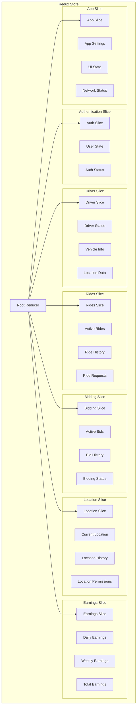

# State Management

## Overview

RydeIQ Driver uses Redux Toolkit for predictable state management with Redux Persist for selective state persistence. The state is organized into focused slices that handle specific domains of the application.

## Redux Store Structure



## Slice Implementations

### Auth Slice

**File**: `src/store/slices/authSlice.js`

```javascript
import { createSlice, createAsyncThunk } from '@reduxjs/toolkit';

const initialState = {
  user: null,
  isAuthenticated: false,
  isLoading: false,
  error: null,
  hasOnboarded: false,
  emailVerified: false,
  lastLoginAt: null
};

// Async thunks
export const signInUser = createAsyncThunk(
  'auth/signInUser',
  async ({ email, password }, { rejectWithValue }) => {
    try {
      const result = await AuthService.signIn(email, password);
      if (result.success) {
        return result.user;
      } else {
        return rejectWithValue(result.error);
      }
    } catch (error) {
      return rejectWithValue(error.message);
    }
  }
);

export const signOutUser = createAsyncThunk(
  'auth/signOutUser',
  async (_, { rejectWithValue }) => {
    try {
      const result = await AuthService.signOut();
      if (result.success) {
        return null;
      } else {
        return rejectWithValue(result.error);
      }
    } catch (error) {
      return rejectWithValue(error.message);
    }
  }
);

const authSlice = createSlice({
  name: 'auth',
  initialState,
  reducers: {
    clearError: (state) => {
      state.error = null;
    },
    setHasOnboarded: (state, action) => {
      state.hasOnboarded = action.payload;
    },
    updateUserProfile: (state, action) => {
      if (state.user) {
        state.user = { ...state.user, ...action.payload };
      }
    }
  },
  extraReducers: (builder) => {
    builder
      // Sign in
      .addCase(signInUser.pending, (state) => {
        state.isLoading = true;
        state.error = null;
      })
      .addCase(signInUser.fulfilled, (state, action) => {
        state.isLoading = false;
        state.user = action.payload;
        state.isAuthenticated = true;
        state.hasOnboarded = action.payload.hasOnboarded || false;
        state.emailVerified = action.payload.emailVerified || false;
        state.lastLoginAt = new Date().toISOString();
        state.error = null;
      })
      .addCase(signInUser.rejected, (state, action) => {
        state.isLoading = false;
        state.error = action.payload;
        state.isAuthenticated = false;
        state.user = null;
      })
      
      // Sign out
      .addCase(signOutUser.fulfilled, (state) => {
        state.user = null;
        state.isAuthenticated = false;
        state.hasOnboarded = false;
        state.emailVerified = false;
        state.lastLoginAt = null;
        state.error = null;
      });
  }
});

export const { clearError, setHasOnboarded, updateUserProfile } = authSlice.actions;
export default authSlice.reducer;

// Selectors
export const selectUser = (state) => state.auth.user;
export const selectIsAuthenticated = (state) => state.auth.isAuthenticated;
export const selectHasOnboarded = (state) => state.auth.hasOnboarded;
export const selectAuthLoading = (state) => state.auth.isLoading;
export const selectAuthError = (state) => state.auth.error;
```

### Driver Slice

**File**: `src/store/slices/driverSlice.js`

```javascript
import { createSlice, createAsyncThunk } from '@reduxjs/toolkit';

const initialState = {
  profile: null,
  status: 'offline', // 'offline' | 'available' | 'busy' | 'break'
  isOnline: false,
  location: null,
  vehicleInfo: null,
  specialtyVehicleInfo: null,
  earnings: {
    today: 0,
    thisWeek: 0,
    thisMonth: 0,
    total: 0
  },
  rating: 0,
  totalRides: 0,
  isLoading: false,
  error: null
};

// Async thunks
export const updateDriverStatus = createAsyncThunk(
  'driver/updateStatus',
  async (status, { rejectWithValue }) => {
    try {
      const result = await DriverStatusService.updateDriverStatus(status);
      if (result.success) {
        return { status, isOnline: status === 'available' };
      } else {
        return rejectWithValue(result.error);
      }
    } catch (error) {
      return rejectWithValue(error.message);
    }
  }
);

export const updateDriverLocation = createAsyncThunk(
  'driver/updateLocation',
  async (location, { rejectWithValue }) => {
    try {
      const result = await DriverStatusService.updateDriverLocation(location);
      if (result.success) {
        return location;
      } else {
        return rejectWithValue(result.error);
      }
    } catch (error) {
      return rejectWithValue(error.message);
    }
  }
);

const driverSlice = createSlice({
  name: 'driver',
  initialState,
  reducers: {
    setDriverProfile: (state, action) => {
      state.profile = action.payload;
      state.vehicleInfo = action.payload.vehicle_info;
      state.specialtyVehicleInfo = action.payload.specialtyVehicleInfo;
    },
    updateEarnings: (state, action) => {
      state.earnings = { ...state.earnings, ...action.payload };
    },
    updateRating: (state, action) => {
      state.rating = action.payload;
    },
    incrementRideCount: (state) => {
      state.totalRides += 1;
    },
    clearError: (state) => {
      state.error = null;
    }
  },
  extraReducers: (builder) => {
    builder
      // Update status
      .addCase(updateDriverStatus.pending, (state) => {
        state.isLoading = true;
        state.error = null;
      })
      .addCase(updateDriverStatus.fulfilled, (state, action) => {
        state.isLoading = false;
        state.status = action.payload.status;
        state.isOnline = action.payload.isOnline;
        state.error = null;
      })
      .addCase(updateDriverStatus.rejected, (state, action) => {
        state.isLoading = false;
        state.error = action.payload;
      })
      
      // Update location
      .addCase(updateDriverLocation.fulfilled, (state, action) => {
        state.location = action.payload;
      })
      .addCase(updateDriverLocation.rejected, (state, action) => {
        state.error = action.payload;
      });
  }
});

export const {
  setDriverProfile,
  updateEarnings,
  updateRating,
  incrementRideCount,
  clearError
} = driverSlice.actions;

export default driverSlice.reducer;

// Selectors
export const selectDriverProfile = (state) => state.driver.profile;
export const selectDriverStatus = (state) => state.driver.status;
export const selectIsDriverOnline = (state) => state.driver.isOnline;
export const selectDriverLocation = (state) => state.driver.location;
export const selectDriverEarnings = (state) => state.driver.earnings;
export const selectDriverRating = (state) => state.driver.rating;
```

### Rides Slice

**File**: `src/store/slices/ridesSlice.js`

```javascript
import { createSlice, createAsyncThunk } from '@reduxjs/toolkit';

const initialState = {
  activeRide: null,
  rideRequests: [],
  rideHistory: [],
  currentRide: null,
  isLoading: false,
  error: null,
  filters: {
    status: 'all',
    dateRange: 'week'
  }
};

// Async thunks
export const fetchRideRequests = createAsyncThunk(
  'rides/fetchRequests',
  async (_, { rejectWithValue }) => {
    try {
      const requests = await RideRequestService.getActiveRideRequests();
      return requests;
    } catch (error) {
      return rejectWithValue(error.message);
    }
  }
);

export const acceptRideRequest = createAsyncThunk(
  'rides/acceptRequest',
  async ({ rideRequestId, bidAmount }, { rejectWithValue }) => {
    try {
      const result = await RideRequestService.acceptRideRequest(rideRequestId, bidAmount);
      if (result.success) {
        return { rideRequestId, finalPrice: result.finalPrice };
      } else {
        return rejectWithValue(result.error);
      }
    } catch (error) {
      return rejectWithValue(error.message);
    }
  }
);

export const startRide = createAsyncThunk(
  'rides/startRide',
  async (rideData, { rejectWithValue }) => {
    try {
      // Implementation for starting a ride
      return rideData;
    } catch (error) {
      return rejectWithValue(error.message);
    }
  }
);

export const completeRide = createAsyncThunk(
  'rides/completeRide',
  async (rideData, { rejectWithValue }) => {
    try {
      // Implementation for completing a ride
      return rideData;
    } catch (error) {
      return rejectWithValue(error.message);
    }
  }
);

const ridesSlice = createSlice({
  name: 'rides',
  initialState,
  reducers: {
    addRideRequest: (state, action) => {
      state.rideRequests.unshift(action.payload);
    },
    removeRideRequest: (state, action) => {
      state.rideRequests = state.rideRequests.filter(
        request => request.id !== action.payload
      );
    },
    setActiveRide: (state, action) => {
      state.activeRide = action.payload;
    },
    clearActiveRide: (state) => {
      state.activeRide = null;
    },
    updateRideStatus: (state, action) => {
      const { rideId, status } = action.payload;
      if (state.activeRide && state.activeRide.id === rideId) {
        state.activeRide.status = status;
      }
    },
    setFilters: (state, action) => {
      state.filters = { ...state.filters, ...action.payload };
    },
    clearError: (state) => {
      state.error = null;
    }
  },
  extraReducers: (builder) => {
    builder
      // Fetch ride requests
      .addCase(fetchRideRequests.pending, (state) => {
        state.isLoading = true;
        state.error = null;
      })
      .addCase(fetchRideRequests.fulfilled, (state, action) => {
        state.isLoading = false;
        state.rideRequests = action.payload;
        state.error = null;
      })
      .addCase(fetchRideRequests.rejected, (state, action) => {
        state.isLoading = false;
        state.error = action.payload;
      })
      
      // Accept ride request
      .addCase(acceptRideRequest.pending, (state) => {
        state.isLoading = true;
        state.error = null;
      })
      .addCase(acceptRideRequest.fulfilled, (state, action) => {
        state.isLoading = false;
        const { rideRequestId } = action.payload;
        state.rideRequests = state.rideRequests.filter(
          request => request.id !== rideRequestId
        );
        state.activeRide = action.payload;
        state.error = null;
      })
      .addCase(acceptRideRequest.rejected, (state, action) => {
        state.isLoading = false;
        state.error = action.payload;
      })
      
      // Start ride
      .addCase(startRide.fulfilled, (state, action) => {
        state.currentRide = action.payload;
        state.activeRide = action.payload;
      })
      
      // Complete ride
      .addCase(completeRide.fulfilled, (state, action) => {
        state.rideHistory.unshift(action.payload);
        state.currentRide = null;
        state.activeRide = null;
      });
  }
});

export const {
  addRideRequest,
  removeRideRequest,
  setActiveRide,
  clearActiveRide,
  updateRideStatus,
  setFilters,
  clearError
} = ridesSlice.actions;

export default ridesSlice.reducer;

// Selectors
export const selectRideRequests = (state) => state.rides.rideRequests;
export const selectActiveRide = (state) => state.rides.activeRide;
export const selectCurrentRide = (state) => state.rides.currentRide;
export const selectRideHistory = (state) => state.rides.rideHistory;
export const selectRidesLoading = (state) => state.rides.isLoading;
export const selectRidesError = (state) => state.rides.error;
export const selectRidesFilters = (state) => state.rides.filters;
```

### Bidding Slice

**File**: `src/store/slices/biddingSlice.js`

```javascript
import { createSlice, createAsyncThunk } from '@reduxjs/toolkit';

const initialState = {
  activeBids: [],
  bidHistory: [],
  currentBid: null,
  biddingSettings: {
    autoBid: false,
    maxBidAmount: 50,
    preferredBidIncrement: 5
  },
  isLoading: false,
  error: null
};

// Async thunks
export const submitBid = createAsyncThunk(
  'bidding/submitBid',
  async ({ rideRequestId, bidAmount, bidType = 'custom' }, { rejectWithValue }) => {
    try {
      const result = await RideRequestService.submitCustomBid(rideRequestId, bidAmount, bidType);
      if (result.success) {
        return {
          rideRequestId,
          bidAmount: result.bidAmount,
          bidType,
          submittedAt: new Date().toISOString()
        };
      } else {
        return rejectWithValue(result.error);
      }
    } catch (error) {
      return rejectWithValue(error.message);
    }
  }
);

export const cancelBid = createAsyncThunk(
  'bidding/cancelBid',
  async (bidId, { rejectWithValue }) => {
    try {
      // Implementation for canceling a bid
      return bidId;
    } catch (error) {
      return rejectWithValue(error.message);
    }
  }
);

const biddingSlice = createSlice({
  name: 'bidding',
  initialState,
  reducers: {
    addActiveBid: (state, action) => {
      state.activeBids.push(action.payload);
    },
    removeActiveBid: (state, action) => {
      state.activeBids = state.activeBids.filter(bid => bid.id !== action.payload);
    },
    setCurrentBid: (state, action) => {
      state.currentBid = action.payload;
    },
    clearCurrentBid: (state) => {
      state.currentBid = null;
    },
    updateBiddingSettings: (state, action) => {
      state.biddingSettings = { ...state.biddingSettings, ...action.payload };
    },
    clearError: (state) => {
      state.error = null;
    }
  },
  extraReducers: (builder) => {
    builder
      // Submit bid
      .addCase(submitBid.pending, (state) => {
        state.isLoading = true;
        state.error = null;
      })
      .addCase(submitBid.fulfilled, (state, action) => {
        state.isLoading = false;
        state.activeBids.push(action.payload);
        state.currentBid = action.payload;
        state.error = null;
      })
      .addCase(submitBid.rejected, (state, action) => {
        state.isLoading = false;
        state.error = action.payload;
      })
      
      // Cancel bid
      .addCase(cancelBid.fulfilled, (state, action) => {
        const bidId = action.payload;
        state.activeBids = state.activeBids.filter(bid => bid.id !== bidId);
        if (state.currentBid && state.currentBid.id === bidId) {
          state.currentBid = null;
        }
      });
  }
});

export const {
  addActiveBid,
  removeActiveBid,
  setCurrentBid,
  clearCurrentBid,
  updateBiddingSettings,
  clearError
} = biddingSlice.actions;

export default biddingSlice.reducer;

// Selectors
export const selectActiveBids = (state) => state.bidding.activeBids;
export const selectBidHistory = (state) => state.bidding.bidHistory;
export const selectCurrentBid = (state) => state.bidding.currentBid;
export const selectBiddingSettings = (state) => state.bidding.biddingSettings;
export const selectBiddingLoading = (state) => state.bidding.isLoading;
export const selectBiddingError = (state) => state.bidding.error;
```

### Location Slice

**File**: `src/store/slices/locationSlice.js`

```javascript
import { createSlice, createAsyncThunk } from '@reduxjs/toolkit';

const initialState = {
  currentLocation: null,
  locationHistory: [],
  isTracking: false,
  permissions: {
    foreground: false,
    background: false
  },
  accuracy: 'high',
  isLoading: false,
  error: null
};

// Async thunks
export const getCurrentLocation = createAsyncThunk(
  'location/getCurrent',
  async (_, { rejectWithValue }) => {
    try {
      const location = await LocationService.getCurrentLocation();
      return location;
    } catch (error) {
      return rejectWithValue(error.message);
    }
  }
);

export const startLocationTracking = createAsyncThunk(
  'location/startTracking',
  async (_, { rejectWithValue }) => {
    try {
      const result = await LocationService.startLocationTracking();
      if (result.success) {
        return true;
      } else {
        return rejectWithValue(result.error);
      }
    } catch (error) {
      return rejectWithValue(error.message);
    }
  }
);

export const stopLocationTracking = createAsyncThunk(
  'location/stopTracking',
  async (_, { rejectWithValue }) => {
    try {
      const result = await LocationService.stopLocationTracking();
      if (result.success) {
        return false;
      } else {
        return rejectWithValue(result.error);
      }
    } catch (error) {
      return rejectWithValue(error.message);
    }
  }
);

const locationSlice = createSlice({
  name: 'location',
  initialState,
  reducers: {
    updateLocation: (state, action) => {
      state.currentLocation = action.payload;
      state.locationHistory.unshift(action.payload);
      
      // Keep only last 100 locations
      if (state.locationHistory.length > 100) {
        state.locationHistory = state.locationHistory.slice(0, 100);
      }
    },
    setPermissions: (state, action) => {
      state.permissions = { ...state.permissions, ...action.payload };
    },
    setAccuracy: (state, action) => {
      state.accuracy = action.payload;
    },
    clearLocationHistory: (state) => {
      state.locationHistory = [];
    },
    clearError: (state) => {
      state.error = null;
    }
  },
  extraReducers: (builder) => {
    builder
      // Get current location
      .addCase(getCurrentLocation.pending, (state) => {
        state.isLoading = true;
        state.error = null;
      })
      .addCase(getCurrentLocation.fulfilled, (state, action) => {
        state.isLoading = false;
        state.currentLocation = action.payload;
        state.locationHistory.unshift(action.payload);
        state.error = null;
      })
      .addCase(getCurrentLocation.rejected, (state, action) => {
        state.isLoading = false;
        state.error = action.payload;
      })
      
      // Start tracking
      .addCase(startLocationTracking.fulfilled, (state) => {
        state.isTracking = true;
      })
      .addCase(startLocationTracking.rejected, (state, action) => {
        state.error = action.payload;
      })
      
      // Stop tracking
      .addCase(stopLocationTracking.fulfilled, (state) => {
        state.isTracking = false;
      })
      .addCase(stopLocationTracking.rejected, (state, action) => {
        state.error = action.payload;
      });
  }
});

export const {
  updateLocation,
  setPermissions,
  setAccuracy,
  clearLocationHistory,
  clearError
} = locationSlice.actions;

export default locationSlice.reducer;

// Selectors
export const selectCurrentLocation = (state) => state.location.currentLocation;
export const selectLocationHistory = (state) => state.location.locationHistory;
export const selectIsTracking = (state) => state.location.isTracking;
export const selectLocationPermissions = (state) => state.location.permissions;
export const selectLocationAccuracy = (state) => state.location.accuracy;
export const selectLocationLoading = (state) => state.location.isLoading;
export const selectLocationError = (state) => state.location.error;
```

## Redux Persist Configuration

**File**: `src/store/index.js`

```javascript
import { configureStore } from '@reduxjs/toolkit';
import { persistStore, persistReducer } from 'redux-persist';
import AsyncStorage from '@react-native-async-storage/async-storage';
import { combineReducers } from '@reduxjs/toolkit';

// Import slices
import authSlice from './slices/authSlice';
import driverSlice from './slices/driverSlice';
import appSlice from './slices/appSlice';
// Note: Some slices are temporarily disabled due to Firebase import issues

// Persist configuration
const persistConfig = {
  key: 'root',
  storage: AsyncStorage,
  whitelist: ['auth', 'driver', 'app'], // Only persist safe slices
  blacklist: ['location', 'rides'] // Don't persist real-time data
};

// Root reducer
const rootReducer = combineReducers({
  auth: authSlice,
  driver: driverSlice,
  app: appSlice,
  // Other slices will be re-enabled as Firebase issues are resolved
});

// Persisted reducer
const persistedReducer = persistReducer(persistConfig, rootReducer);

// Configure store
export const store = configureStore({
  reducer: persistedReducer,
  middleware: (getDefaultMiddleware) =>
    getDefaultMiddleware({
      serializableCheck: {
        ignoredActions: ['persist/PERSIST', 'persist/REHYDRATE']
      }
    }),
  devTools: __DEV__
});

export const persistor = persistStore(store);
```

## Middleware

### Custom Middleware

```javascript
// Auth middleware
const authMiddleware = (store) => (next) => (action) => {
  // Sync authentication state with Firebase
  if (action.type === 'auth/signInUser/fulfilled') {
    // Initialize driver services
    DriverStatusService.initialize(action.payload.id);
  }
  
  if (action.type === 'auth/signOutUser/fulfilled') {
    // Cleanup services
    DriverStatusService.cleanup();
  }
  
  return next(action);
};

// Location middleware
const locationMiddleware = (store) => (next) => (action) => {
  // Automatically update driver location when location changes
  if (action.type === 'location/updateLocation') {
    const state = store.getState();
    if (state.driver.isOnline) {
      DriverStatusService.updateDriverLocation(action.payload);
    }
  }
  
  return next(action);
};

// Notification middleware
const notificationMiddleware = (store) => (next) => (action) => {
  // Handle push notifications based on state changes
  if (action.type === 'rides/addRideRequest') {
    // Show ride request notification
    NotificationService.showRideRequestNotification(action.payload);
  }
  
  return next(action);
};
```

## Data Flow Patterns

### Component to Store

```javascript
// Using hooks in components
import { useSelector, useDispatch } from 'react-redux';
import { updateDriverStatus, selectDriverStatus } from '@/store/slices/driverSlice';

const DriverDashboard = () => {
  const dispatch = useDispatch();
  const driverStatus = useSelector(selectDriverStatus);
  
  const handleStatusChange = (newStatus) => {
    dispatch(updateDriverStatus(newStatus));
  };
  
  return (
    // Component JSX
  );
};
```

### Async Actions

```javascript
// Using async thunks
import { useDispatch } from 'react-redux';
import { fetchRideRequests } from '@/store/slices/ridesSlice';

const RideRequestScreen = () => {
  const dispatch = useDispatch();
  
  useEffect(() => {
    dispatch(fetchRideRequests());
  }, [dispatch]);
  
  // Component logic
};
```

### Real-time Updates

```javascript
// Service integration with Redux
class RideRequestService {
  constructor(dispatch) {
    this.dispatch = dispatch;
  }
  
  onRideRequestReceived = (rideRequest) => {
    this.dispatch(addRideRequest(rideRequest));
  };
  
  onBidAccepted = (bidData) => {
    this.dispatch(setActiveRide(bidData));
  };
}
```

## Performance Optimizations

### Selective Persistence

```javascript
// Only persist essential data
const persistConfig = {
  key: 'root',
  storage: AsyncStorage,
  whitelist: ['auth', 'driver', 'app'],
  blacklist: ['location', 'rides', 'bidding'] // Real-time data
};
```

### Memoized Selectors

```javascript
import { createSelector } from '@reduxjs/toolkit';

// Memoized selector for filtered ride requests
export const selectFilteredRideRequests = createSelector(
  [selectRideRequests, selectRidesFilters],
  (requests, filters) => {
    return requests.filter(request => {
      if (filters.status !== 'all' && request.status !== filters.status) {
        return false;
      }
      // Additional filtering logic
      return true;
    });
  }
);

// Memoized selector for driver earnings summary
export const selectEarningsSummary = createSelector(
  [selectDriverEarnings],
  (earnings) => ({
    daily: earnings.today,
    weekly: earnings.thisWeek,
    monthly: earnings.thisMonth,
    total: earnings.total,
    average: earnings.total / Math.max(earnings.totalRides, 1)
  })
);
```

### State Normalization

```javascript
// Normalized state structure for better performance
const initialState = {
  entities: {
    rides: {},
    drivers: {},
    riders: {}
  },
  ids: {
    rides: [],
    drivers: [],
    riders: []
  },
  loading: {
    rides: false,
    drivers: false,
    riders: false
  }
};
```

---

**Next**: [Getting Started - Installation](./getting-started/installation.md) - Environment setup and dependencies
