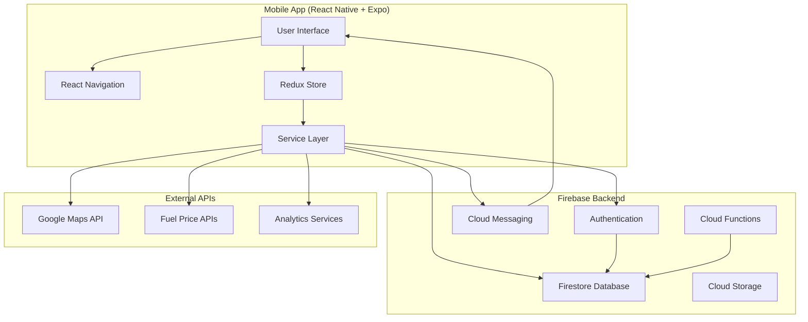
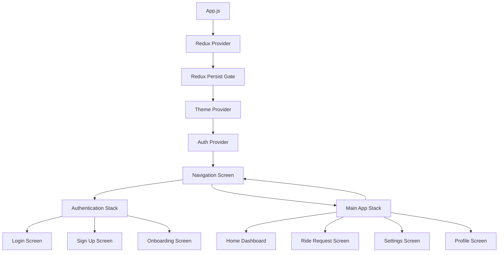
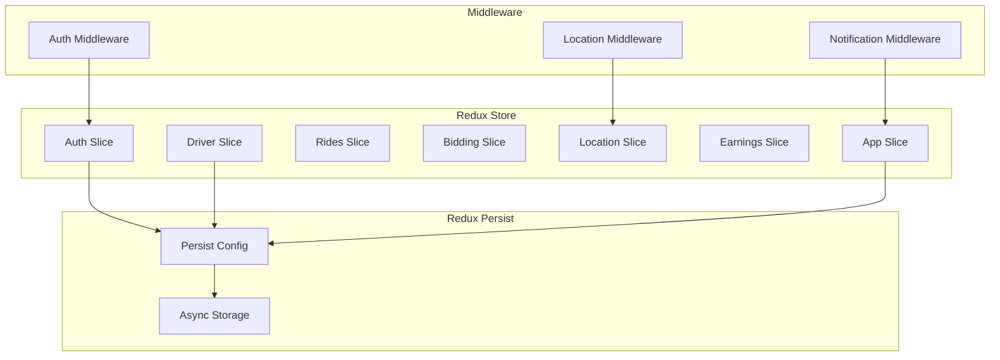
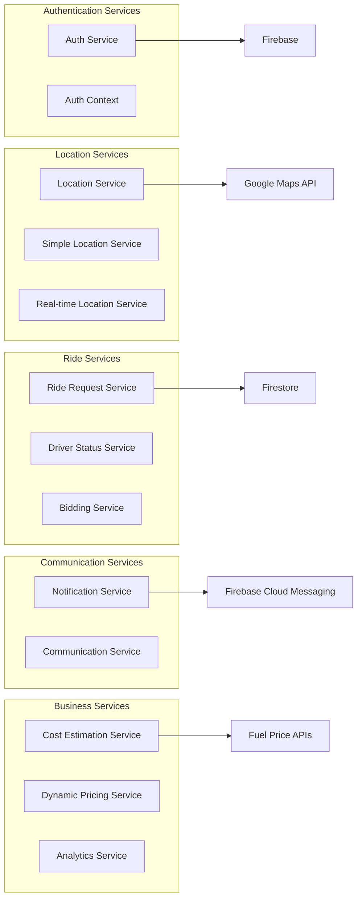
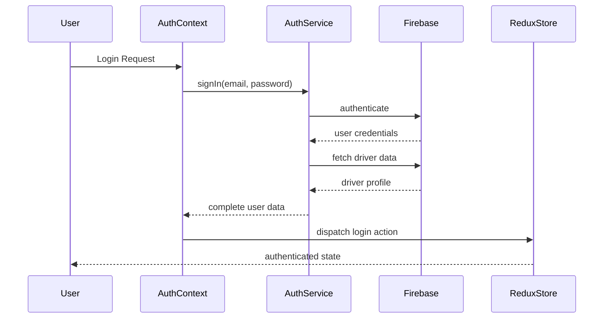
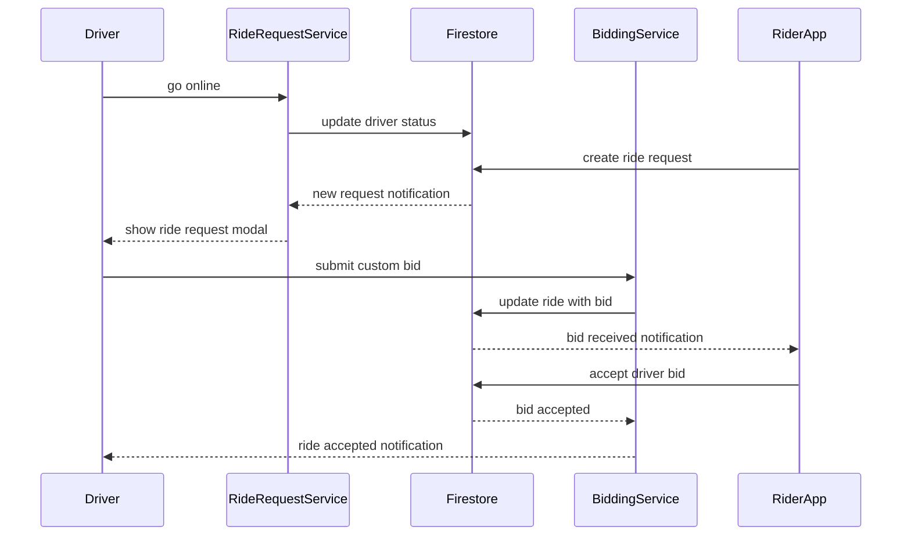
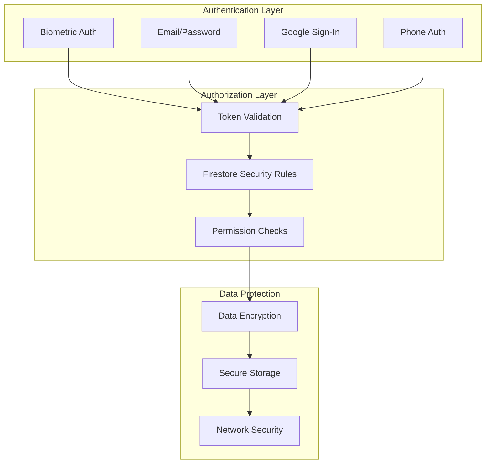
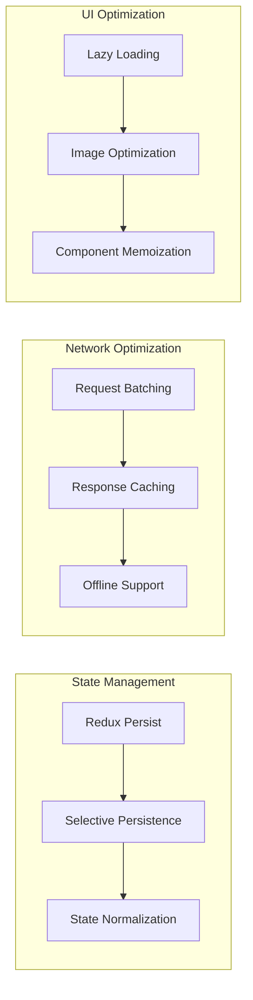
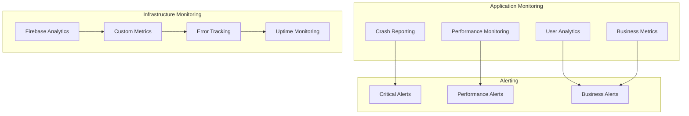

# System Architecture

## Overview

RydeIQ Driver is a React Native mobile application built with Expo, featuring a sophisticated bidding system for ride-sharing services. The app integrates with Firebase for backend services and Google Maps for location-based features.

## High-Level Architecture

## Component Architecture

### App Structure

### State Management Architecture

## Service Layer Architecture

### Core Services

## Data Flow Architecture

### Authentication Flow

### Ride Request Flow

## Technology Stack

### Frontend
- **React Native 0.79.5** - Cross-platform mobile framework
- **Expo 53** - Development platform and build tools
- **React Navigation 6** - Navigation library
- **Redux Toolkit** - State management
- **React Native Maps** - Map integration
- **Expo Location** - Location services

### Backend Services
- **Firebase Authentication** - User authentication
- **Firebase Firestore** - NoSQL database
- **Firebase Cloud Messaging** - Push notifications
- **Firebase Storage** - File storage
- **Firebase Functions** - Serverless functions

### External APIs
- **Google Maps API** - Maps, directions, geocoding
- **EIA API** - Fuel price data
- **GasBuddy API** - Premium fuel data (optional)

### Development Tools
- **ESLint** - Code linting
- **Babel** - JavaScript transpilation
- **Metro** - React Native bundler
- **EAS Build** - Cloud build service

## Security Architecture

### Authentication & Authorization

### Data Security Measures
- **TLS 1.3** for all network communications
- **Firebase Security Rules** for database access control
- **Expo SecureStore** for sensitive data storage
- **Token-based authentication** with automatic refresh
- **Input validation** and sanitization
- **Error handling** without sensitive data exposure

## Performance Architecture

### Optimization Strategies

### Performance Features
- **Redux Persist** - Selective state persistence
- **Image Optimization** - Compressed assets and lazy loading
- **Network Efficiency** - Request batching and caching
- **Background Processing** - Minimal battery impact
- **Memory Management** - Proper cleanup and data retention limits

## Scalability Considerations

### Horizontal Scaling
- **Firebase Auto-scaling** - Backend services scale automatically
- **CDN Integration** - Static assets served via CDN
- **Regional Deployment** - Multi-region Firebase setup

### Vertical Scaling
- **Component Optimization** - Efficient React Native components
- **State Management** - Normalized Redux state structure
- **Database Indexing** - Optimized Firestore queries

### Future Enhancements
- **Microservices Migration** - Gradual migration from Firebase Functions
- **GraphQL Integration** - More efficient data fetching
- **Progressive Web App** - Web version for broader reach
- **Multi-tenant Architecture** - Support for multiple ride-sharing companies

## Monitoring & Observability

### Analytics & Monitoring

### Monitoring Tools
- **Firebase Analytics** - User behavior and app performance
- **Firebase Crashlytics** - Crash reporting and analysis
- **Custom Metrics** - Business-specific KPIs
- **Performance Monitoring** - App launch times and render performance
- **Error Boundaries** - Graceful error handling and reporting

---

**Next**: [Database Schema](./database-schema.md) - Detailed Firestore data models and relationships
