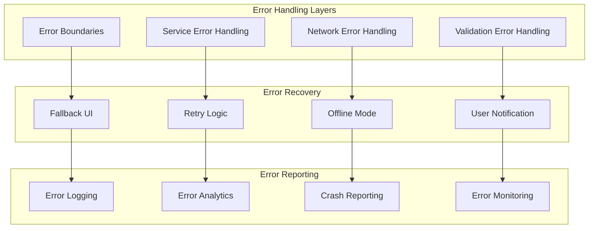

# Error Handling

## Overview

Comprehensive error handling strategy for the RydeIQ Driver app, covering error boundaries, service error handling, user experience, and debugging.

## Error Handling Architecture



## Error Boundaries

### Global Error Boundary

**File**: `src/components/common/ErrorBoundary.js`

```javascript
import React from 'react';
import { View, Text, TouchableOpacity, StyleSheet } from 'react-native';

class ErrorBoundary extends React.Component {
  constructor(props) {
    super(props);
    this.state = { hasError: false, error: null, errorInfo: null };
  }
  
  static getDerivedStateFromError(error) {
    return { hasError: true };
  }
  
  componentDidCatch(error, errorInfo) {
    this.setState({
      error: error,
      errorInfo: errorInfo
    });
    
    // Log error to crash reporting service
    this.logErrorToService(error, errorInfo);
  }
  
  logErrorToService = (error, errorInfo) => {
    try {
      // Log to Firebase Crashlytics
      crashlytics().recordError(error);
      
      // Log to custom analytics
      analytics().logEvent('app_error', {
        error_message: error.message,
        error_stack: error.stack,
        component_stack: errorInfo.componentStack
      });
      
      // Log to console in development
      if (__DEV__) {
        console.error('Error Boundary caught an error:', error, errorInfo);
      }
    } catch (loggingError) {
      console.error('Failed to log error:', loggingError);
    }
  };
  
  handleRetry = () => {
    this.setState({ hasError: false, error: null, errorInfo: null });
  };
  
  render() {
    if (this.state.hasError) {
      return (
        <View style={styles.container}>
          <Text style={styles.title}>Something went wrong</Text>
          <Text style={styles.message}>
            We're sorry, but something unexpected happened. 
            Please try again or restart the app.
          </Text>
          
          {__DEV__ && (
            <View style={styles.debugContainer}>
              <Text style={styles.debugTitle}>Debug Information:</Text>
              <Text style={styles.debugText}>
                {this.state.error && this.state.error.toString()}
              </Text>
              <Text style={styles.debugText}>
                {this.state.errorInfo.componentStack}
              </Text>
            </View>
          )}
          
          <TouchableOpacity style={styles.retryButton} onPress={this.handleRetry}>
            <Text style={styles.retryButtonText}>Try Again</Text>
          </TouchableOpacity>
        </View>
      );
    }
    
    return this.props.children;
  }
}

const styles = StyleSheet.create({
  container: {
    flex: 1,
    justifyContent: 'center',
    alignItems: 'center',
    padding: 20,
    backgroundColor: '#FFFFFF'
  },
  title: {
    fontSize: 24,
    fontWeight: 'bold',
    color: '#EF4444',
    marginBottom: 16,
    textAlign: 'center'
  },
  message: {
    fontSize: 16,
    color: '#6B7280',
    textAlign: 'center',
    marginBottom: 24,
    lineHeight: 24
  },
  debugContainer: {
    backgroundColor: '#F3F4F6',
    padding: 16,
    borderRadius: 8,
    marginBottom: 24,
    width: '100%'
  },
  debugTitle: {
    fontSize: 14,
    fontWeight: 'bold',
    color: '#374151',
    marginBottom: 8
  },
  debugText: {
    fontSize: 12,
    color: '#6B7280',
    fontFamily: 'monospace'
  },
  retryButton: {
    backgroundColor: '#10B981',
    paddingHorizontal: 24,
    paddingVertical: 12,
    borderRadius: 8
  },
  retryButtonText: {
    color: '#FFFFFF',
    fontSize: 16,
    fontWeight: '600'
  }
});

export default ErrorBoundary;
```

### Component-Specific Error Boundaries

```javascript
// For specific screens or components
const ScreenErrorBoundary = ({ children, screenName }) => {
  return (
    <ErrorBoundary
      fallback={
        <View style={styles.screenErrorContainer}>
          <Text style={styles.screenErrorTitle}>
            {screenName} is temporarily unavailable
          </Text>
          <Text style={styles.screenErrorMessage}>
            Please try again or go back to the main screen.
          </Text>
        </View>
      }
    >
      {children}
    </ErrorBoundary>
  );
};

// Usage
const HomeScreen = () => {
  return (
    <ScreenErrorBoundary screenName="Home Screen">
      <HomeScreenContent />
    </ScreenErrorBoundary>
  );
};
```

## Service Error Handling

### Service Error Handler

**File**: `src/utils/errorHandler.js`

```javascript
// Error types and codes
export const ERROR_TYPES = {
  NETWORK: 'network_error',
  AUTHENTICATION: 'authentication_error',
  PERMISSION: 'permission_error',
  VALIDATION: 'validation_error',
  BUSINESS_LOGIC: 'business_logic_error',
  UNKNOWN: 'unknown_error'
};

export const ERROR_CODES = {
  // Network errors
  NETWORK_UNAVAILABLE: 'NETWORK_UNAVAILABLE',
  REQUEST_TIMEOUT: 'REQUEST_TIMEOUT',
  CONNECTION_FAILED: 'CONNECTION_FAILED',
  
  // Authentication errors
  INVALID_CREDENTIALS: 'INVALID_CREDENTIALS',
  TOKEN_EXPIRED: 'TOKEN_EXPIRED',
  PERMISSION_DENIED: 'PERMISSION_DENIED',
  
  // Firebase errors
  FIREBASE_AUTH_ERROR: 'FIREBASE_AUTH_ERROR',
  FIRESTORE_ERROR: 'FIRESTORE_ERROR',
  FCM_ERROR: 'FCM_ERROR',
  
  // Location errors
  LOCATION_PERMISSION_DENIED: 'LOCATION_PERMISSION_DENIED',
  LOCATION_SERVICE_DISABLED: 'LOCATION_SERVICE_DISABLED',
  LOCATION_UNAVAILABLE: 'LOCATION_UNAVAILABLE'
};

// Error handler class
export class ErrorHandler {
  static handle(error, context = {}) {
    const errorInfo = this.analyzeError(error, context);
    
    // Log error
    this.logError(errorInfo);
    
    // Show user notification if needed
    if (errorInfo.showToUser) {
      this.showUserNotification(errorInfo);
    }
    
    // Return standardized error response
    return {
      success: false,
      error: {
        code: errorInfo.code,
        message: errorInfo.userMessage,
        type: errorInfo.type,
        context: errorInfo.context,
        timestamp: new Date().toISOString()
      }
    };
  }
  
  static analyzeError(error, context) {
    let errorInfo = {
      code: ERROR_CODES.UNKNOWN,
      type: ERROR_TYPES.UNKNOWN,
      userMessage: 'An unexpected error occurred. Please try again.',
      showToUser: true,
      context: context,
      originalError: error
    };
    
    // Analyze error based on type
    if (error.code) {
      errorInfo = this.analyzeFirebaseError(error, errorInfo);
    } else if (error.message) {
      errorInfo = this.analyzeGenericError(error, errorInfo);
    } else if (error.name) {
      errorInfo = this.analyzeNamedError(error, errorInfo);
    }
    
    return errorInfo;
  }
  
  static analyzeFirebaseError(error, errorInfo) {
    switch (error.code) {
      case 'auth/user-not-found':
        errorInfo.code = ERROR_CODES.INVALID_CREDENTIALS;
        errorInfo.type = ERROR_TYPES.AUTHENTICATION;
        errorInfo.userMessage = 'No account found with this email address.';
        break;
        
      case 'auth/wrong-password':
        errorInfo.code = ERROR_CODES.INVALID_CREDENTIALS;
        errorInfo.type = ERROR_TYPES.AUTHENTICATION;
        errorInfo.userMessage = 'Incorrect password. Please try again.';
        break;
        
      case 'auth/email-already-in-use':
        errorInfo.code = ERROR_CODES.INVALID_CREDENTIALS;
        errorInfo.type = ERROR_TYPES.AUTHENTICATION;
        errorInfo.userMessage = 'An account with this email already exists.';
        break;
        
      case 'permission-denied':
        errorInfo.code = ERROR_CODES.PERMISSION_DENIED;
        errorInfo.type = ERROR_TYPES.PERMISSION;
        errorInfo.userMessage = 'You do not have permission to perform this action.';
        break;
        
      case 'unavailable':
        errorInfo.code = ERROR_CODES.NETWORK_UNAVAILABLE;
        errorInfo.type = ERROR_TYPES.NETWORK;
        errorInfo.userMessage = 'Service is temporarily unavailable. Please try again later.';
        break;
        
      default:
        errorInfo.code = ERROR_CODES.FIREBASE_AUTH_ERROR;
        errorInfo.type = ERROR_TYPES.UNKNOWN;
        errorInfo.userMessage = 'Authentication error. Please try again.';
    }
    
    return errorInfo;
  }
  
  static analyzeGenericError(error, errorInfo) {
    if (error.message.includes('Network request failed')) {
      errorInfo.code = ERROR_CODES.NETWORK_UNAVAILABLE;
      errorInfo.type = ERROR_TYPES.NETWORK;
      errorInfo.userMessage = 'Network connection failed. Please check your internet connection.';
    } else if (error.message.includes('timeout')) {
      errorInfo.code = ERROR_CODES.REQUEST_TIMEOUT;
      errorInfo.type = ERROR_TYPES.NETWORK;
      errorInfo.userMessage = 'Request timed out. Please try again.';
    } else if (error.message.includes('permission')) {
      errorInfo.code = ERROR_CODES.PERMISSION_DENIED;
      errorInfo.type = ERROR_TYPES.PERMISSION;
      errorInfo.userMessage = 'Permission denied. Please check your app permissions.';
    }
    
    return errorInfo;
  }
  
  static logError(errorInfo) {
    try {
      // Log to Firebase Crashlytics
      crashlytics().recordError(errorInfo.originalError);
      
      // Log to analytics
      analytics().logEvent('error_occurred', {
        error_code: errorInfo.code,
        error_type: errorInfo.type,
        error_message: errorInfo.originalError.message,
        context: JSON.stringify(errorInfo.context)
      });
      
      // Log to console in development
      if (__DEV__) {
        console.error('Error Handler:', errorInfo);
      }
    } catch (loggingError) {
      console.error('Failed to log error:', loggingError);
    }
  }
  
  static showUserNotification(errorInfo) {
    // Show appropriate user notification
    if (errorInfo.type === ERROR_TYPES.NETWORK) {
      Alert.alert(
        'Connection Error',
        errorInfo.userMessage,
        [{ text: 'OK' }]
      );
    } else if (errorInfo.type === ERROR_TYPES.AUTHENTICATION) {
      Alert.alert(
        'Authentication Error',
        errorInfo.userMessage,
        [{ text: 'OK' }]
      );
    } else if (errorInfo.type === ERROR_TYPES.PERMISSION) {
      Alert.alert(
        'Permission Required',
        errorInfo.userMessage,
        [
          { text: 'Cancel', style: 'cancel' },
          { text: 'Settings', onPress: () => Linking.openSettings() }
        ]
      );
    } else {
      Alert.alert(
        'Error',
        errorInfo.userMessage,
        [{ text: 'OK' }]
      );
    }
  }
}
```

### Service Error Wrapper

```javascript
// Wrapper for service methods
export const withErrorHandling = (serviceMethod) => {
  return async (...args) => {
    try {
      return await serviceMethod(...args);
    } catch (error) {
      return ErrorHandler.handle(error, {
        serviceMethod: serviceMethod.name,
        arguments: args
      });
    }
  };
};

// Usage in services
class RideRequestService {
  submitCustomBid = withErrorHandling(async (rideRequestId, bidAmount) => {
    // Service implementation
    const result = await this.performBidSubmission(rideRequestId, bidAmount);
    return { success: true, data: result };
  });
}
```

## Network Error Handling

### Network Error Handler

```javascript
import NetInfo from '@react-native-community/netinfo';

export class NetworkErrorHandler {
  static async checkNetworkConnection() {
    try {
      const state = await NetInfo.fetch();
      return {
        isConnected: state.isConnected,
        isInternetReachable: state.isInternetReachable,
        type: state.type
      };
    } catch (error) {
      return {
        isConnected: false,
        isInternetReachable: false,
        type: 'unknown'
      };
    }
  }
  
  static async handleNetworkError(error, retryCallback) {
    const networkState = await this.checkNetworkConnection();
    
    if (!networkState.isConnected) {
      return {
        success: false,
        error: {
          code: ERROR_CODES.NETWORK_UNAVAILABLE,
          message: 'No internet connection. Please check your network settings.',
          retryCallback: retryCallback
        }
      };
    }
    
    if (!networkState.isInternetReachable) {
      return {
        success: false,
        error: {
          code: ERROR_CODES.CONNECTION_FAILED,
          message: 'Internet connection is not reachable. Please try again.',
          retryCallback: retryCallback
        }
      };
    }
    
    return {
      success: false,
      error: {
        code: ERROR_CODES.REQUEST_TIMEOUT,
        message: 'Request failed. Please try again.',
        retryCallback: retryCallback
      }
    };
  }
}
```

### Retry Logic

```javascript
export class RetryHandler {
  static async withRetry(operation, maxRetries = 3, delay = 1000) {
    let lastError;
    
    for (let attempt = 1; attempt <= maxRetries; attempt++) {
      try {
        return await operation();
      } catch (error) {
        lastError = error;
        
        if (attempt === maxRetries) {
          break;
        }
        
        // Exponential backoff
        const waitTime = delay * Math.pow(2, attempt - 1);
        await new Promise(resolve => setTimeout(resolve, waitTime));
      }
    }
    
    throw lastError;
  }
  
  static async withNetworkRetry(operation, maxRetries = 3) {
    return this.withRetry(async () => {
      const networkState = await NetworkErrorHandler.checkNetworkConnection();
      
      if (!networkState.isConnected) {
        throw new Error('Network unavailable');
      }
      
      return await operation();
    }, maxRetries);
  }
}
```

## Validation Error Handling

### Input Validation

```javascript
export class ValidationErrorHandler {
  static validateEmail(email) {
    const emailRegex = /^[^\s@]+@[^\s@]+\.[^\s@]+$/;
    
    if (!email) {
      return {
        isValid: false,
        error: 'Email is required'
      };
    }
    
    if (!emailRegex.test(email)) {
      return {
        isValid: false,
        error: 'Please enter a valid email address'
      };
    }
    
    return { isValid: true };
  }
  
  static validatePassword(password) {
    if (!password) {
      return {
        isValid: false,
        error: 'Password is required'
      };
    }
    
    if (password.length < 6) {
      return {
        isValid: false,
        error: 'Password must be at least 6 characters long'
      };
    }
    
    return { isValid: true };
  }
  
  static validateBidAmount(amount, minAmount = 1, maxAmount = 500) {
    const numAmount = parseFloat(amount);
    
    if (isNaN(numAmount)) {
      return {
        isValid: false,
        error: 'Please enter a valid amount'
      };
    }
    
    if (numAmount < minAmount) {
      return {
        isValid: false,
        error: `Minimum bid amount is $${minAmount}`
      };
    }
    
    if (numAmount > maxAmount) {
      return {
        isValid: false,
        error: `Maximum bid amount is $${maxAmount}`
      };
    }
    
    return { isValid: true };
  }
}
```

## User Experience Error Handling

### Error Toast Component

```javascript
import React, { useEffect } from 'react';
import { View, Text, Animated, StyleSheet } from 'react-native';

const ErrorToast = ({ error, onDismiss, duration = 5000 }) => {
  const fadeAnim = new Animated.Value(0);
  
  useEffect(() => {
    if (error) {
      // Fade in
      Animated.timing(fadeAnim, {
        toValue: 1,
        duration: 300,
        useNativeDriver: true
      }).start();
      
      // Auto dismiss
      const timer = setTimeout(() => {
        onDismiss();
      }, duration);
      
      return () => clearTimeout(timer);
    }
  }, [error]);
  
  const handleDismiss = () => {
    Animated.timing(fadeAnim, {
      toValue: 0,
      duration: 300,
      useNativeDriver: true
    }).start(() => {
      onDismiss();
    });
  };
  
  if (!error) return null;
  
  return (
    <Animated.View style={[styles.container, { opacity: fadeAnim }]}>
      <View style={styles.toast}>
        <Text style={styles.errorText}>{error.message}</Text>
        <TouchableOpacity onPress={handleDismiss} style={styles.dismissButton}>
          <Text style={styles.dismissText}>×</Text>
        </TouchableOpacity>
      </View>
    </Animated.View>
  );
};

const styles = StyleSheet.create({
  container: {
    position: 'absolute',
    top: 50,
    left: 20,
    right: 20,
    zIndex: 1000
  },
  toast: {
    backgroundColor: '#EF4444',
    padding: 16,
    borderRadius: 8,
    flexDirection: 'row',
    alignItems: 'center',
    justifyContent: 'space-between'
  },
  errorText: {
    color: '#FFFFFF',
    fontSize: 14,
    flex: 1
  },
  dismissButton: {
    marginLeft: 16
  },
  dismissText: {
    color: '#FFFFFF',
    fontSize: 18,
    fontWeight: 'bold'
  }
});

export default ErrorToast;
```

## Error Monitoring and Reporting

### Error Analytics

```javascript
export class ErrorAnalytics {
  static trackError(error, context = {}) {
    try {
      // Firebase Analytics
      analytics().logEvent('error_occurred', {
        error_code: error.code,
        error_message: error.message,
        error_stack: error.stack,
        context: JSON.stringify(context),
        timestamp: new Date().toISOString(),
        user_id: auth().currentUser?.uid || 'anonymous'
      });
      
      // Custom error tracking
      if (MIXPANEL_KEY) {
        mixpanel.track('Error Occurred', {
          error_code: error.code,
          error_message: error.message,
          context: context
        });
      }
    } catch (trackingError) {
      console.error('Failed to track error:', trackingError);
    }
  }
  
  static trackErrorRecovery(error, recoveryAction) {
    try {
      analytics().logEvent('error_recovery', {
        error_code: error.code,
        recovery_action: recoveryAction,
        timestamp: new Date().toISOString()
      });
    } catch (trackingError) {
      console.error('Failed to track error recovery:', trackingError);
    }
  }
}
```

## Best Practices

### 1. Error Handling Strategy
- Use error boundaries for component-level errors
- Implement service-level error handling
- Provide meaningful error messages to users
- Log errors for debugging and monitoring

### 2. User Experience
- Show appropriate error messages
- Provide retry mechanisms
- Implement offline fallbacks
- Use progressive error disclosure

### 3. Error Recovery
- Implement automatic retry logic
- Provide manual retry options
- Use fallback data when possible
- Guide users to alternative actions

### 4. Monitoring and Analytics
- Track error occurrences and patterns
- Monitor error recovery rates
- Set up alerts for critical errors
- Regular error analysis and improvement

## Documentation

- **[Service Layer Documentation](./services.md)**
- **[Testing Documentation](./testing.md)**
- **[Monitoring and Analytics](../deployment/monitoring.md)**

## Contributing

1. Follow established error handling patterns
2. Add appropriate error logging
3. Test error scenarios
4. Update error documentation
5. Consider user experience in error handling
