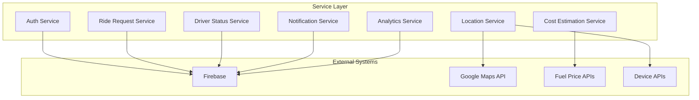

# Service Layer Documentation

## Overview

The service layer provides clean interfaces between the RydeIQ Driver app and external systems. Services handle business logic, API integrations, and data management.

## Service Architecture



## Core Services

### Authentication Service

**File**: `src/services/firebase/config.js`

**Purpose**: Handle user authentication and profile management.

**Key Methods**:
```javascript
// Sign in with email and password
const signIn = async (email, password) => {
  try {
    const userCredential = await signInWithEmailAndPassword(auth, email, password);
    return { success: true, user: userCredential.user };
  } catch (error) {
    return { success: false, error: error.message };
  }
};

// Sign up new user
const signUp = async (email, password, userData) => {
  try {
    const userCredential = await createUserWithEmailAndPassword(auth, email, password);
    await setDoc(doc(db, 'driverApplications', userCredential.user.uid), userData);
    return { success: true, user: userCredential.user };
  } catch (error) {
    return { success: false, error: error.message };
  }
};

// Sign out current user
const signOut = async () => {
  try {
    await signOut(auth);
    return { success: true };
  } catch (error) {
    return { success: false, error: error.message };
  }
};
```

**Usage Example**:
```javascript
import { AuthService } from '@/services/firebase/config';

const handleLogin = async () => {
  const result = await AuthService.signIn(email, password);
  if (result.success) {
    // Handle successful login
    dispatch(setUser(result.user));
  } else {
    // Handle login error
    setError(result.error);
  }
};
```

### Ride Request Service

**File**: `src/services/rideRequestService.js`

**Purpose**: Manage ride requests, bidding, and ride matching.

**Key Methods**:
```javascript
// Initialize service with driver ID
const initialize = (driverId) => {
  this.currentDriverId = driverId;
  this.startListeningForRideRequests();
};

// Start listening for new ride requests
const startListeningForRideRequests = () => {
  const q = query(
    rideRequestsRef,
    where('availableDrivers', 'array-contains', this.currentDriverId),
    where('status', 'in', ['open_for_bids', 'pending']),
    where('timestamp', '>=', tenMinutesAgo),
    orderBy('timestamp', 'desc')
  );
  
  const unsubscribe = onSnapshot(q, (snapshot) => {
    snapshot.docChanges().forEach((change) => {
      if (change.type === 'added') {
        this.handleNewRideRequest(change.doc.data());
      }
    });
  });
};

// Submit custom bid for ride request
const submitCustomBid = async (rideRequestId, bidAmount, bidType = 'custom') => {
  try {
    const validatedBidAmount = this.validateBidAmount(bidAmount, rideRequest);
    const newBid = {
      driverId: this.currentDriverId,
      bidAmount: validatedBidAmount,
      bidType: bidType,
      submittedAt: new Date(),
      // ... other bid data
    };
    
    await updateDoc(rideRequestRef, {
      driverBids: arrayUnion(newBid),
      lastBidUpdate: new Date()
    });
    
    return { success: true, rideRequestId, bidAmount: validatedBidAmount };
  } catch (error) {
    throw error;
  }
};
```

**Usage Example**:
```javascript
import RideRequestService from '@/services/rideRequestService';

// Initialize service
RideRequestService.initialize(driverId);

// Set callback for new ride requests
RideRequestService.setRideRequestCallback((rideRequest) => {
  dispatch(addRideRequest(rideRequest));
});

// Submit bid
const handleSubmitBid = async (rideRequestId, bidAmount) => {
  try {
    const result = await RideRequestService.submitCustomBid(rideRequestId, bidAmount);
    if (result.success) {
      // Handle successful bid submission
      dispatch(setCurrentBid(result));
    }
  } catch (error) {
    // Handle bid submission error
    setError(error.message);
  }
};
```

### Driver Status Service

**File**: `src/services/driverStatusService.js`

**Purpose**: Manage driver availability, location tracking, and status updates.

**Key Methods**:
```javascript
// Update driver status
const updateDriverStatus = async (status) => {
  try {
    const driverRef = doc(this.db, 'driverApplications', this.currentDriverId);
    await updateDoc(driverRef, {
      status: status,
      isOnline: status === 'available',
      lastStatusUpdate: serverTimestamp()
    });
    
    return { success: true, status };
  } catch (error) {
    throw error;
  }
};

// Update driver location
const updateDriverLocation = async (location) => {
  try {
    const driverRef = doc(this.db, 'driverApplications', this.currentDriverId);
    await updateDoc(driverRef, {
      location: new GeoPoint(location.latitude, location.longitude),
      lastLocationUpdate: serverTimestamp()
    });
    
    return { success: true };
  } catch (error) {
    throw error;
  }
};

// Start automatic location updates
const startLocationUpdates = async (intervalMs = 30000) => {
  try {
    const result = await SimpleLocationService.startTracking();
    if (result && result.success) {
      return { success: true, usingSimpleService: true };
    } else {
      return this.startBasicLocationUpdates(intervalMs);
    }
  } catch (error) {
    return this.startBasicLocationUpdates(intervalMs);
  }
};
```

**Usage Example**:
```javascript
import DriverStatusService from '@/services/driverStatusService';

// Initialize service
await DriverStatusService.initialize(driverId, userData);

// Go online
const handleGoOnline = async () => {
  try {
    await DriverStatusService.goOnline();
    dispatch(updateDriverStatus('available'));
  } catch (error) {
    setError(error.message);
  }
};

// Update location
const handleLocationUpdate = async (location) => {
  try {
    await DriverStatusService.updateDriverLocation(location);
    dispatch(updateLocation(location));
  } catch (error) {
    console.error('Location update failed:', error);
  }
};
```

### Location Service

**File**: `src/services/location/index.js`

**Purpose**: Handle GPS tracking, location permissions, and geocoding.

**Key Methods**:
```javascript
// Get current location
const getCurrentLocation = async () => {
  try {
    const { status } = await Location.getForegroundPermissionsAsync();
    if (status !== 'granted') {
      // Return default location if permission not granted
      return {
        latitude: 35.3733,
        longitude: -119.0187,
        accuracy: 1000,
        timestamp: Date.now()
      };
    }
    
    const location = await Location.getCurrentPositionAsync({
      accuracy: Location.Accuracy.High,
      maximumAge: 10000
    });
    
    return {
      latitude: location.coords.latitude,
      longitude: location.coords.longitude,
      accuracy: location.coords.accuracy,
      timestamp: location.timestamp
    };
  } catch (error) {
    // Return default location on error
    return {
      latitude: 35.3733,
      longitude: -119.0187,
      accuracy: 1000,
      timestamp: Date.now()
    };
  }
};

// Start location tracking
const startLocationTracking = async () => {
  try {
    TaskManager.defineTask(LOCATION_TRACKING, ({ data, error }) => {
      if (error) return;
      if (data) {
        const { locations } = data;
        // Handle new locations
      }
    });
    
    await Location.startLocationUpdatesAsync(LOCATION_TRACKING, {
      accuracy: Location.Accuracy.High,
      timeInterval: 5000,
      distanceInterval: 10,
      showsBackgroundLocationIndicator: true
    });
    
    return { success: true };
  } catch (error) {
    return { success: false, error: error.message };
  }
};

// Calculate distance between two points
const calculateDistance = (lat1, lon1, lat2, lon2) => {
  const R = 6371; // Earth's radius in kilometers
  const dLat = (lat2 - lat1) * Math.PI / 180;
  const dLon = (lon2 - lon1) * Math.PI / 180;
  const a = 
    Math.sin(dLat/2) * Math.sin(dLat/2) +
    Math.cos(lat1 * Math.PI / 180) * Math.cos(lat2 * Math.PI / 180) * 
    Math.sin(dLon/2) * Math.sin(dLon/2);
  const c = 2 * Math.atan2(Math.sqrt(a), Math.sqrt(1-a));
  const distance = R * c;
  
  return distance * 0.621371; // Convert to miles
};
```

**Usage Example**:
```javascript
import { getCurrentLocation, startLocationTracking } from '@/services/location';

// Get current location
const handleGetLocation = async () => {
  try {
    const location = await getCurrentLocation();
    dispatch(updateLocation(location));
  } catch (error) {
    setError(error.message);
  }
};

// Start tracking
const handleStartTracking = async () => {
  try {
    const result = await startLocationTracking();
    if (result.success) {
      dispatch(setTrackingStatus(true));
    }
  } catch (error) {
    setError(error.message);
  }
};
```

### Notification Service

**File**: `src/services/notifications/index.js`

**Purpose**: Handle push notifications and in-app messaging.

**Key Methods**:
```javascript
// Initialize notifications
const initializeNotifications = async () => {
  try {
    // Request permission for iOS
    if (Platform.OS === 'ios') {
      const authStatus = await messaging().requestPermission();
      const enabled =
        authStatus === messaging.AuthorizationStatus.AUTHORIZED ||
        authStatus === messaging.AuthorizationStatus.PROVISIONAL;
      
      if (!enabled) return null;
    }
    
    // Get FCM token
    const token = await messaging().getToken();
    
    // Configure notification channels for Android
    if (Platform.OS === 'android') {
      await messaging().setNotificationChannelAsync('ride-requests', {
        name: 'Ride Requests',
        importance: 'high',
        vibrationPattern: [0, 250, 250, 250],
        lightColor: '#10B981'
      });
    }
    
    return token;
  } catch (error) {
    console.error('Error initializing notifications:', error);
    return null;
  }
};

// Subscribe to driver topics
const subscribeToDriverTopics = async (driverId, city, vehicleType) => {
  const topics = [
    `driver_${driverId}`,
    `city_${city.toLowerCase().replace(/\s+/g, '_')}`,
    `vehicle_${vehicleType.toLowerCase()}`,
    'all_drivers'
  ];
  
  const results = await Promise.allSettled(
    topics.map(topic => subscribeToTopic(topic))
  );
  
  const successful = results.filter(result => result.status === 'fulfilled').length;
  return successful === topics.length;
};
```

**Usage Example**:
```javascript
import { initializeNotifications, subscribeToDriverTopics } from '@/services/notifications';

// Initialize notifications
const handleInitializeNotifications = async () => {
  try {
    const token = await initializeNotifications();
    if (token) {
      // Store token for server use
      dispatch(setNotificationToken(token));
    }
  } catch (error) {
    setError(error.message);
  }
};

// Subscribe to topics
const handleSubscribeTopics = async () => {
  try {
    const success = await subscribeToDriverTopics(driverId, city, vehicleType);
    if (success) {
      dispatch(setNotificationSubscribed(true));
    }
  } catch (error) {
    setError(error.message);
  }
};
```

## Business Logic Services

### Cost Estimation Service

**File**: `src/services/costEstimationService.js`

**Purpose**: Calculate fuel costs and profit margins for rides.

**Key Methods**:
```javascript
// Calculate fuel cost for trip
const calculateFuelCost = async (distance, vehicleType, currentLocation) => {
  try {
    // Get current fuel prices
    const fuelPrices = await getCurrentFuelPrices(currentLocation);
    
    // Get vehicle efficiency
    const efficiency = await getVehicleEfficiency(vehicleType);
    
    // Calculate fuel consumption
    const fuelConsumption = (distance / efficiency.milesPerGallon) * efficiency.fuelType;
    
    // Calculate cost
    const fuelCost = fuelConsumption * fuelPrices[vehicleType];
    
    return {
      fuelCost: fuelCost,
      fuelConsumption: fuelConsumption,
      efficiency: efficiency,
      fuelPrices: fuelPrices
    };
  } catch (error) {
    throw error;
  }
};

// Calculate profit margin
const calculateProfitMargin = (rideFare, fuelCost, timeCost, otherCosts = 0) => {
  const totalCosts = fuelCost + timeCost + otherCosts;
  const profit = rideFare - totalCosts;
  const profitMargin = (profit / rideFare) * 100;
  
  return {
    profit: profit,
    profitMargin: profitMargin,
    totalCosts: totalCosts,
    rideFare: rideFare
  };
};
```

### Analytics Service

**File**: `src/services/analyticsService.js`

**Purpose**: Track app usage, performance, and business metrics.

**Key Methods**:
```javascript
// Track user event
const trackEvent = (eventName, parameters = {}) => {
  try {
    // Firebase Analytics
    analytics().logEvent(eventName, parameters);
    
    // Custom analytics
    if (MIXPANEL_KEY) {
      mixpanel.track(eventName, parameters);
    }
    
    if (AMPLITUDE_KEY) {
      amplitude.getInstance().logEvent(eventName, parameters);
    }
  } catch (error) {
    console.error('Analytics tracking failed:', error);
  }
};

// Track ride completion
const trackRideCompletion = (rideData) => {
  trackEvent('ride_completed', {
    ride_id: rideData.id,
    distance: rideData.distance,
    duration: rideData.duration,
    fare: rideData.fare,
    fuel_cost: rideData.fuelCost,
    profit_margin: rideData.profitMargin
  });
};
```

## Service Integration Patterns

### Service Initialization

```javascript
// Initialize all services
const initializeServices = async (userId) => {
  try {
    // Initialize core services
    await RideRequestService.initialize(userId);
    await DriverStatusService.initialize(userId);
    
    // Initialize location services
    const locationResult = await initializeLocationServices();
    if (locationResult.success) {
      await DriverStatusService.startLocationUpdates();
    }
    
    // Initialize notifications
    const notificationToken = await initializeNotifications();
    if (notificationToken) {
      await DriverStatusService.updateNotificationToken(notificationToken);
    }
    
    return { success: true };
  } catch (error) {
    console.error('Service initialization failed:', error);
    return { success: false, error: error.message };
  }
};
```

### Error Handling

```javascript
// Service error handling wrapper
const withErrorHandling = (serviceMethod) => {
  return async (...args) => {
    try {
      return await serviceMethod(...args);
    } catch (error) {
      // Log error
      console.error('Service error:', error);
      
      // Handle specific error types
      if (error.code === 'permission-denied') {
        return { success: false, error: 'Permission denied' };
      }
      
      if (error.code === 'network-error') {
        return { success: false, error: 'Network unavailable' };
      }
      
      // Re-throw unexpected errors
      throw error;
    }
  };
};
```

### Service Cleanup

```javascript
// Cleanup all services
const cleanupServices = () => {
  try {
    RideRequestService.cleanup();
    DriverStatusService.cleanup();
    stopLocationTracking();
    
    console.log('Services cleaned up successfully');
  } catch (error) {
    console.error('Service cleanup failed:', error);
  }
};
```

## Best Practices

### 1. Service Design
- Keep services focused and single-purpose
- Use dependency injection for testability
- Implement proper error handling
- Use async/await for clean asynchronous code

### 2. Error Handling
- Always wrap async calls in try/catch
- Provide meaningful error messages
- Implement fallback mechanisms
- Log errors for debugging

### 3. Performance
- Cache frequently accessed data
- Implement request debouncing
- Use background processing for heavy operations
- Optimize API calls and reduce redundancy

### 4. Testing
- Write unit tests for all service methods
- Mock external dependencies
- Test error scenarios
- Use dependency injection for testability

## Documentation

- **[API Documentation](../architecture/api-documentation.md)**
- **[Firebase Configuration](../getting-started/configuration.md#firebase-configuration)**
- **[Service Testing](./testing.md)**

## Contributing

1. Follow established service patterns
2. Add comprehensive error handling
3. Write tests for new services
4. Update documentation
5. Use TypeScript for better type safety
